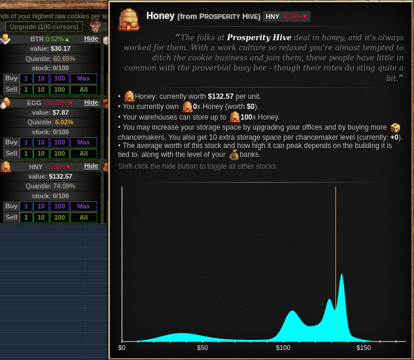

Insugar Trading
===============

This is an add-on for [Cookie Clicker](https://orteil.dashnet.org/cookieclicker/)
that helps analyze the Stock Market minigame.

This add-on contains two parts:
the [dataset](#dataset), which is a histogram of the stock values in the stock market,
collected in a simulation of 1000 years of the market ups and downs;
and the [statistics display](#statistics),
which shows the histogram and the quantiles of the current stock values.


Dataset
=======

The grand goal of this addon is to display the [statistics](#statistics) described below.
Lacking a mathematical model,
I wrote a tool to approximate the probability density function of the stock values
by simply simulating the stock market for a thousand years.
(If left unattended, the stock market ticks once every minute,
so simulating 525960000 ticks corresponds to a thousand years of stock market ups and downs.)
This produced a histogram,
which tracks how many times each stock had a given value,
with a $0.10 precision.

Since the bank level influences the stock values,
I simulated for bank levels between 1 and 10
(which I believe to be the most common levels).
So the dataset actually has 150 histograms,
one for each bank level and each stock.

See the source code for details on how to collect the data yourself;
this feature is _not_ available through the user interface.

Highlights
----------

Averages and a five-number summary for banks level 1.

| Good | Average | Min  | 1st quartile | Median | 3rd quartile | Max   |
|------|---------|------|--------------|--------|--------------|-------|
| CRL  |  $14.78 | $1   |         4.85 |   9.06 |        23.97 | 118.7 |
| CHC  |  $19.92 | $1   |         5.45 |  15.74 |        32.41 | 121.4 |
| BTR  |  $25.98 | $1   |         7.70 |  23.98 |        41.59 | 123.6 |
| SUG  |  $33.36 | $1   |        13.36 |  33.30 |        51.29 | 128.3 |
| NUT  |  $42.45 | $1   |        22.25 |  43.02 |        61.21 | 129.9 |
| SLT  |  $49.56 | $1   |        31.80 |  52.67 |        70.96 | 131.0 |
| VNL  |  $57.67 | $1   |        41.58 |  62.46 |        80.90 | 139.0 |
| EGG  |  $64.84 | $1   |        51.33 |  72.02 |        90.00 | 141.1 |
| CNM  |  $71.60 | $1   |        61.14 |  81.53 |        97.67 | 151.5 |
| CRM  |  $79.11 | $1   |        70.91 |  90.65 |       103.98 | 160.9 |
| JAM  |  $87.74 | $1   |        80.74 |  99.76 |       113.33 | 169.4 |
| WCH  |  $97.03 | $1   |        90.67 | 108.83 |       123.09 | 179.9 |
| HNY  | $106.73 | $1.6 |       100.55 | 118.45 |       133.01 | 190.1 |
| CKI  | $116.64 | $1.8 |       110.46 | 128.33 |       142.94 | 198.9 |
| RCP  | $126.63 | $3.2 |       120.42 | 138.32 |       152.99 | 209.4 |


Statistics
==========

This add-on modifies the interface to add two bits of information to the stock market.



First,
it modifies the tooltip for the stock market goods
to display the histogram for that specific good,
along with a vertical orange line pointing to the current good price.

Second,
it adds a bar between the current stock value and the amount that stock owned.
It displays the quantile of that stock value,
compared to the dataset.
For example,
in the picture above,
HNY is worth $132.57 and its quantile is 74.09%;
this means that HNY was at or below $132.57 in 74.09% of the time during the simulation.

The color of text ranges from gray to orange:
it is orange for stocks that you don't currently own and are at a low price (quantile-wise),
suggesting you might want to buy those stocks,
and is also orange for stocks you currently own that are at a high price,
suggesting you might want to sell those stocks.
The color is grayer the less true those statements are.

(These statistics are currently available only if the bank level is at most 10.)


Using the mod
=============

The best solution is adding
<https://staticvariablejames.github.io/InsugarTrading/InsugarTrading.js>
to [Cookie Clicker Mod Manager](https://github.com/klattmose/CookieClickerModManager).

Alternatively,
run
```javascript
    Game.LoadMod('https://staticvariablejames.github.io/InsugarTrading/InsugarTrading.js');
```
on your browser Javascript console,
or create a bookmarklet with the code
```javascript
    javascript:(function(){Game.LoadMod('https://staticvariablejames.github.io/InsugarTrading/InsugarTrading.js');}());
```

Changelog
=========

1.0.0
-----

Initial release.

1.1.0
-----

Move the 1.4MB dataset to its own file.


License
=======

Insugar Trading is a Cookie Clicker add-on.
Copyright (C) 2020 Static Variable James

This program is free software: you can redistribute it and/or modify
it under the terms of the GNU General Public License as published by
the Free Software Foundation, either version 3 of the License, or
(at your option) any later version.

This program is distributed in the hope that it will be useful,
but WITHOUT ANY WARRANTY; without even the implied warranty of
MERCHANTABILITY or FITNESS FOR A PARTICULAR PURPOSE. See the
GNU General Public License for more details.

You should have received a copy of the GNU General Public License
along with this program. If not, see <https://www.gnu.org/licenses/>.
