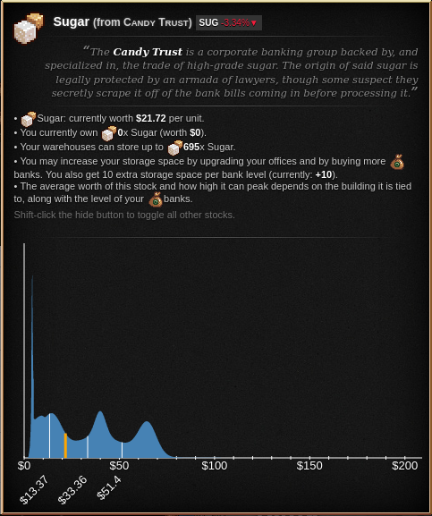
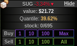

Insugar Trading
===============

This is an add-on for [Cookie Clicker](https://orteil.dashnet.org/cookieclicker/)
that helps analyze the Stock Market minigame.

This add-on contains two parts:
the [dataset](#dataset), which is a histogram of the stock values in the stock market,
collected in a simulation of 1000 years of the market ups and downs;
and the [statistics display](#statistics),
which shows the histogram and the quantiles of the current stock values.


Dataset
=======

The grand goal of this addon is to display the [statistics](#statistics) described below.
Lacking a mathematical model,
I wrote a tool to approximate the probability density function of the stock values
by simply simulating the stock market for a thousand years.
(If left unattended, the stock market ticks once every minute,
so simulating 525960000 ticks corresponds to a thousand years of stock market ups and downs.)
This produced a histogram,
which tracks how many times each stock had a given value,
with a $0.10 precision.

Since the bank level influences the stock values,
I simulated for bank levels between 1 and 50
(which I believe to be the most common levels).
So the dataset actually has 450 histograms,
one for each bank level and each stock.

See the source code for details on how to collect the data yourself;
this feature is _not_ available through the user interface.

Highlights
----------

Averages and a five-number summary for banks level 1.

| Good | Average | Min | 1st quartile | Median | 3rd quartile | Max |
|------|---------|-----|--------------|--------|--------------|-----|
| CRL | 14.79 | 1 | 4.85 | 9.08 | 23.99 | 118.3 |
| CHC | 19.94 | 1 | 5.45 | 15.78 | 32.44 | 125.3 |
| BTR | 25.98 | 1 | 7.7 | 23.95 | 41.58 | 130.7 |
| SUG | 33.39 | 1 | 13.37 | 33.36 | 51.4 | 129.5 |
| NUT | 41.42 | 1 | 22.17 | 42.94 | 61.25 | 128.8 |
| SLT | 49.51 | 1 | 31.74 | 52.56 | 70.97 | 130.5 |
| VNL | 57.6 | 1 | 41.53 | 62.37 | 80.75 | 136.6 |
| EGG | 64.87 | 1 | 51.37 | 72.05 | 90.06 | 143.4 |
| CNM | 71.51 | 1 | 61.07 | 81.34 | 97.61 | 151.1 |
| CRM | 79.09 | 1 | 70.9 | 90.62 | 103.97 | 160 |
| JAM | 87.73 | 1 | 80.75 | 99.66 | 113.3 | 172.9 |
| WCH | 97.02 | 1.1 | 90.65 | 108.77 | 123.1 | 181.7 |
| HNY | 106.78 | 1.7 | 100.61 | 118.52 | 133.01 | 198.5 |
| CKI | 116.73 | 2.4 | 110.56 | 128.49 | 143.01 | 205.4 |
| RCP | 126.74 | 3.3 | 120.52 | 138.49 | 153.04 | 209.2 |
| SBD | 136.61 | 4.9 | 130.4 | 148.28 | 162.97 | 221.8 |


Statistics
==========

This add-on modifies the interface to add two bits of information to the stock market.



First,
it modifies the tooltip for the stock market goods
to display the histogram for that specific good.
The orange line is the current value of the good.
The three white lines are the 25%, 50%, and 75% percentiles,
so, for example, the first quartile for SUG is at $13.37.
The quantiles can be customized in the settings.



Second,
it adds a bar between the current stock value and the amount that stock owned.
It displays the quantile of that stock value,
compared to the dataset.
For example,
in the picture above,
SLT is worth $60.71 and its quantile is 62.78%;
this means that HNY was at or below $60.71 in 62.78% of the time during the simulation.

The color of text ranges from gray to orange:
it is orange for stocks that you don't currently own and are at a low price (quantile-wise),
suggesting you might want to buy those stocks,
and is also orange for stocks you currently own that are at a high price,
suggesting you might want to sell those stocks.
The color is grayer the less true those statements are.

(These statistics are currently available only if the bank level is at most 50.)


Using the mod
=============

The best solution is adding
<https://staticvariablejames.github.io/InsugarTrading/InsugarTrading.js>
to [Cookie Clicker Mod Manager](https://github.com/klattmose/CookieClickerModManager).

Alternatively,
run
```javascript
    Game.LoadMod('https://staticvariablejames.github.io/InsugarTrading/InsugarTrading.js');
```
on your browser Javascript console,
or create a bookmarklet with the code
```javascript
    javascript:(function(){Game.LoadMod('https://staticvariablejames.github.io/InsugarTrading/InsugarTrading.js');}());
```


Changelog
=========

1.0.0
-----

Initial release.

1.1.0
-----

Move the 1.4MB dataset to its own file.

1.1.1
-----

Fix a performance bug when collecting data.

1.1.2
-----

Add datasets for bank levels up to 30,
and display the mod's version number in the stats menu.

1.2.0
-----

The 4.7M dataset was split in files of around 150K each
(one for each bank level);
only the needed datasets are downloaded.
This should ease the burden on slower connections and speed up loading the mod.

Minor improvements on the histogram display.

1.2.1
-----

Fixed bug in which tooltip information would appear twice
after a wipe save (hard reset).

1.2.2
-----

Use CCSE v2.018.

1.2.3
-----

Update to Cookie Clicker v2.031.
The datasets for the new building still need to be computed.

1.2.4
-----

Fix a typo in the histogram generation code.

1.2.5
-----

Register the mod in the game's modding API.

1.3.0
-----

Minor change in graph style.

The graph now has vertical lines displaying specific quantiles.

1.3.1
-----

Datasets replaced with datasets computed with
[Cookie Clicker C++ Tools](https://github.com/staticvariablejames/CookieClickerCppTools).
This means that bank levels between 1 and 50 are available,
including Subsidiaries (Idleverses).

Some internal changes.

1.3.2
-----

Fixed a typo that ate the orange line in the histogram.

1.3.3
-----

Update to CCSE 2.021 and display a notification on load.

1.3.4
-----

Update to CCSE 2.023.

1.3.5
-----

Update to CCSE 2.025.

1.3.6
-----

Update to CCSE 2.026.

The mod won't check the CCSE version anymore.
(Reasoning: currently CCSE updates far more frequently that Choose Your Own Lump,
and usually in a backwards-compatible manner.
Not asking CCSE version every time makes the mod a bit more future-proof.)

1.4.0
-----

Several internal changes, but (hopefully) no externally visible ones.

Ported the mod to TypeScript,
and added a more robust test suite.

Removal of tools for generating the dataset in-game.
The existence of [CCCPP](https://github.com/staticvariablejames/CookieClickerCppTools)
makes them redundant for vanilla Stock market,
and if it is ever needed for modded content,
it should be rewritten using e.g. [Playwright](https://playwright.dev/)
or [Cookie Connoisseur](https://github.com/staticvariablejames/cookie-connoisseur).


Known Bugs/Limitations
======================

Only datasets for banks up to level 50 are available
(although I believe this should be enough for most players).

Currently, the displayed quantiles are not updated if the bank is leveled up.
This issue fixes itself with the next tick,
but the mod displays slightly wrong information before it comes.


License
=======

Insugar Trading is a Cookie Clicker add-on.
Copyright (C) 2020 Static Variable James

This program is free software: you can redistribute it and/or modify
it under the terms of the GNU General Public License as published by
the Free Software Foundation, either version 3 of the License, or
(at your option) any later version.

This program is distributed in the hope that it will be useful,
but WITHOUT ANY WARRANTY; without even the implied warranty of
MERCHANTABILITY or FITNESS FOR A PARTICULAR PURPOSE. See the
GNU General Public License for more details.

You should have received a copy of the GNU General Public License
along with this program. If not, see <https://www.gnu.org/licenses/>.
